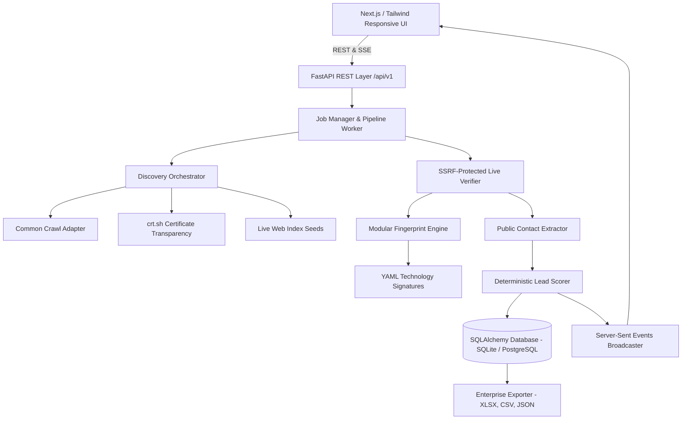

# LeadForge — System Architecture

## Key Components

1. **Discovery Orchestrator (`src/discovery/`)**:
   - Manages pluggable discovery providers (crt.sh, Live Web Seeds, Common Crawl, DNS).
   - Produces candidate domains without calling historical records "live".

2. **Live Verifier (`src/verification/`)**:
   - Executes DNS resolution and HTTP/HTTPS handshakes.
   - Enforces strict SSRF filters (blocking internal CIDRs, loopbacks, and AWS/GCP metadata endpoints).
   - Evaluates TLS certificates, response time latency, and HTTP status codes.

3. **Technology Fingerprint Engine (`src/fingerprint/`)**:
   - Reads declarative rules from `technology_signatures/*.yaml`.
   - Analyzes HTML DOM patterns, meta generators, HTTP headers, cookies, and scripts.
   - Computes weighted confidence and attaches transparent evidence strings to every lead.

4. **Public Contact Extractor (`src/crawler/`)**:
   - Extracts publicly visible business emails, phone lines, social profiles, and JSON-LD schema metadata.
   - Classifies email mailboxes into `ROLE_BASED` (`info@`, `support@`, `sales@`) vs `DIRECT`.

5. **Lead Scorer (`src/scoring/`)**:
   - Deterministic 0–100 scoring algorithm.
   - Assigns ratings (`HOT`, `HIGH`, `MEDIUM`, `LOW`) with human-readable rationale explanations.

6. **Enterprise Exporter (`src/export/`)**:
   - Streams formatted CSV, Excel `.xlsx` (with styling), and JSON exports.
